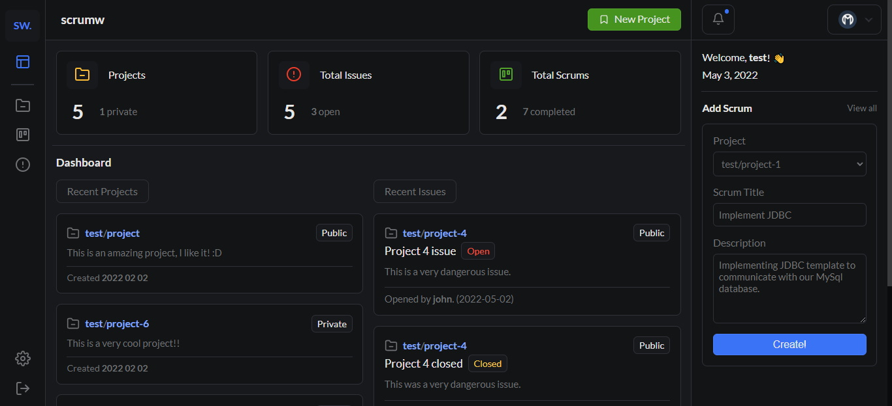

- [What is scrumw?](#what-is-scrumw)
- [Features](#features)
- [Installation](#installation)
  - [Requirements](#requirements)
  - [Creating the database](#creating-the-database)
  - [Cloning the project](#cloning-the-project)
  - [Running the backend](#running-the-backend)
  - [Running the frontend](#running-the-frontend)
- [License](#license)

<hr>

## What is scrumw?
Warning! This project is currently under development, the major features may not work.  
  
Scrumw is a free, open-source, self-hosted scrum & project management system.  
It helps you manage projects, track bugs and issues, and create scrum boards while collaborating with others.  
You can create private projects, if you only want to work with yourself, as well as you can create public projects, to work with others.


<hr>

## Features
- Create public or private projects
- Track and maange bugs, issues and scrums
- Create scrum-boards
- Ability to collaborate with others
- Easy-to-use, modern UI
- CRUD projects, issues & scrums
- User management
- Dark mode
- Notifications

<hr>

## Installation
### Requirements
- Java 16+
- MySQL server
- NodeJS
- Git (optional)

### Creating the database
First, create a database named `scrumw`. [(for example here)](./db/database.sql)  
If it's done, import the [tables](./db/tables.sql), or load the [mysqldump](./db/scrumw_backup.sql). (the database-dump comes with some sample data)  
Also, feel free to make the necessary changes [here](./backend/src/main/resources/application.yml).

### Cloning the project
When it comes to cloning the project, you have 2 options:
- You can [download the zip](https://github.com/0l1v3rr/scrumw/archive/refs/heads/master.zip)
- You can clone it in your command prompt or terminal:
  - ```
    git clone https://github.com/0l1v3rr/scrumw.git
    ```

### Running the backend
Running the backend is very simple.  
Open the `./backend` folder in your favorite IDE (IntelliJ, Eclipse), and run the project. This may take a few secs.  
The backend should start running on port :8080.

### Running the frontend
If you have successfully cloned the project, make it active in your command prompt or terminal. (e.g.: `$ cd Desktop/scrumw`)  
Now enter these commands: 
```sh
cd frontend/

# if it is your first time running the app
npm i

npm run dev
```

## License
This project is licensed under the [Apache-2.0 License](./LICENSE).