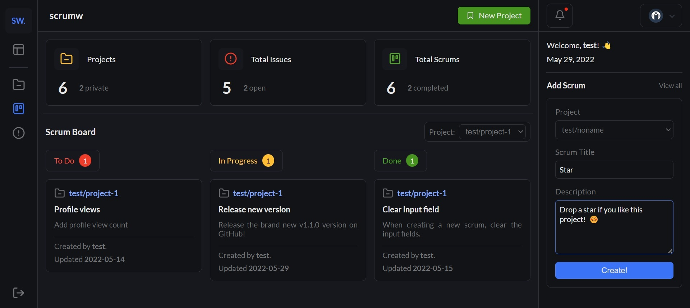

<div align="center">

  # scrumw
  <p>
    
    
  </p>

</div>

<hr>

- [scrumw](#scrumw)
  - [What is scrumw?](#what-is-scrumw)
  - [Tech stack](#tech-stack)
  - [Some of the main features](#some-of-the-main-features)
  - [Important step](#important-step)
  - [Running with Docker](#running-with-docker)
  - [Building from source](#building-from-source)
    - [Requirements](#requirements)
    - [Cloning the project](#cloning-the-project)
    - [Creating the database](#creating-the-database)
    - [Running the backend](#running-the-backend)
    - [Running the frontend](#running-the-frontend)
  - [License](#license)

<hr>

## What is scrumw?
Scrumw is a free, open-source, self-hosted scrum & project management system.  
It helps you manage projects, track bugs and issues, and create scrum boards while collaborating with others.  
You can create private projects, if you only want to work with yourself, as well as you can create public projects, to work with others.

<br>


<hr>

## Tech stack
- **Database:** MySQL
- **Backend:** Java, Spring, Spring Boot, Spring Security, Lombok
- **Frontend:** Svelte, SvelteKit, TypeScript
- **Testing:** JUnit

<hr>

## Some of the main features
- Create public or private projects
- Track and manage bugs, issues and scrums
- Create and manage scrum-boards per project
- Ability to collaborate with others
- Easy-to-use, modern UI
- CRUD projects, issues & scrums
- User management
- Dark mode
- Notifications
- Responsive Web Design

<hr>

## Important step
Before you build or run the application, there's an important step you need to take, 
it doesn't matter if you use [Docker](#running-with-docker) or [build it from the source](#building-from-source).  
In the root folder of the frontend (`~/scrumw/frontend`), create a `.env` file.  
In this file, you need to add the backend's URL.  
For example, if you run it on localhost, it should look like this:
```env
VITE_API_URL=http://localhost:8080
```

<hr>

## Running with Docker
First, download and install Docker  
Then, clone the project:
- You can [download the zip](https://github.com/0l1v3rr/scrumw/archive/refs/heads/master.zip)
- You can clone it in your command prompt or terminal:
  - ```
    git clone https://github.com/0l1v3rr/scrumw.git
    ```
After cloning it, open the project's root folder in the terminal, and enter this command:
```sh
docker-compose up
```

<hr>

## Building from source
### Requirements
- Java 16+
- MySQL server
- NodeJS
- Git (optional)

### Cloning the project
When it comes to cloning the project, you have 2 options:
- You can [download the zip](https://github.com/0l1v3rr/scrumw/archive/refs/heads/master.zip)
- You can clone it in your command prompt or terminal:
  - ```
    git clone https://github.com/0l1v3rr/scrumw.git
    ```

### Creating the database
Using [these](./db/init.sql) queries, set up a database, or load the [mysqldump](./db/scrumw_backup.sql). (the database-dump comes with some sample data)  

### Running the backend
If you have successfully cloned the project, make it active in your command prompt or terminal. (e.g.: `$ cd Desktop/scrumw`)  
Now enter these commands: 
```sh
cd backend/
mvn clean install
java -jar scrumw.jar
```
The backend should start running on port `:8080`.  
  
You can find the API documentation [here](./docs/API.md).

### Running the frontend
If you have successfully cloned the project, make it active in your command prompt or terminal. (e.g.: `$ cd Desktop/scrumw`)  
Now enter these commands: 
```sh
cd frontend/

# if it is your first time running the app
npm i

npm run dev
```

<hr>

## License
This project is licensed under the [Apache-2.0 License](./LICENSE).
